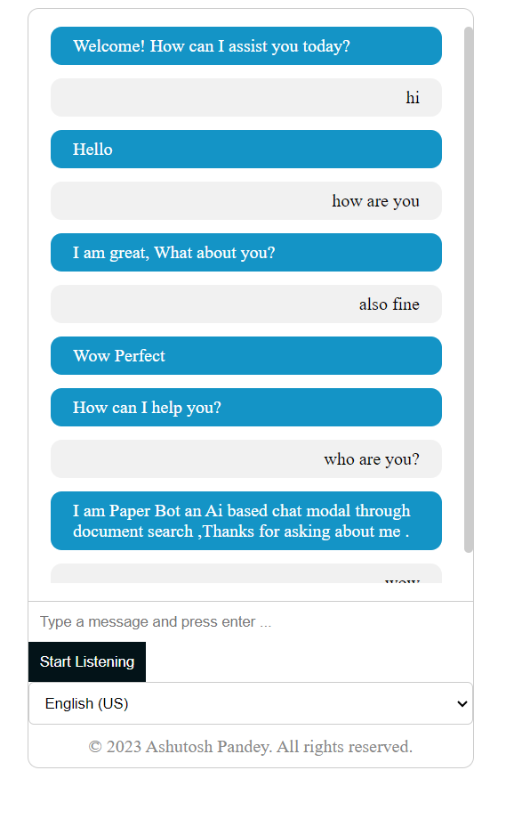

# PaperChatBot

PaperChatBot is an HTML-based user interface with voice recognition input and support text input as well, designed to connect with NLP (Natural Language Processing) for generating responses.

## Features

- Interactive chat interface.
- Voice recognition input for a hands-free experience.
- Seamless integration with NLP models for generating responses.

## Getting Started

### Prerequisites

- Make sure you have a compatible web browser.
- You will need an internet connection to access NLP services.

### Installation

1. Clone the repository:

   ```sh
   git clone https://github.com/theashutoshpandey/PaperChatBot.git
   ```
### User Interface View


